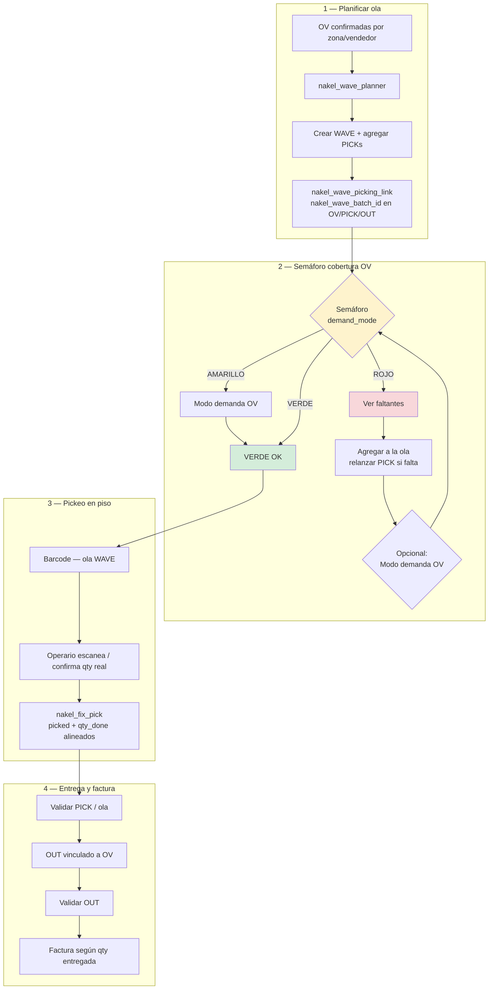
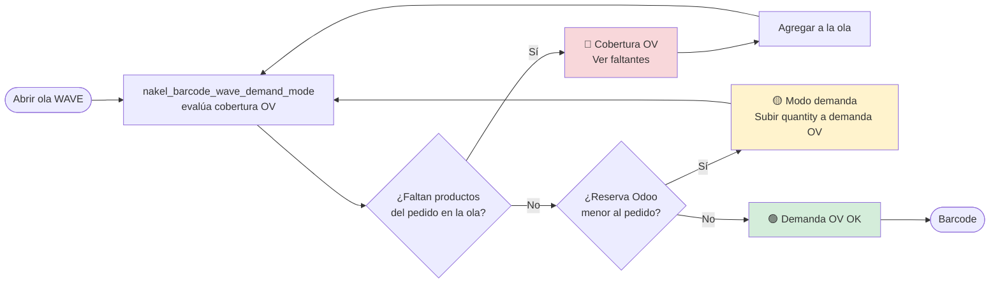
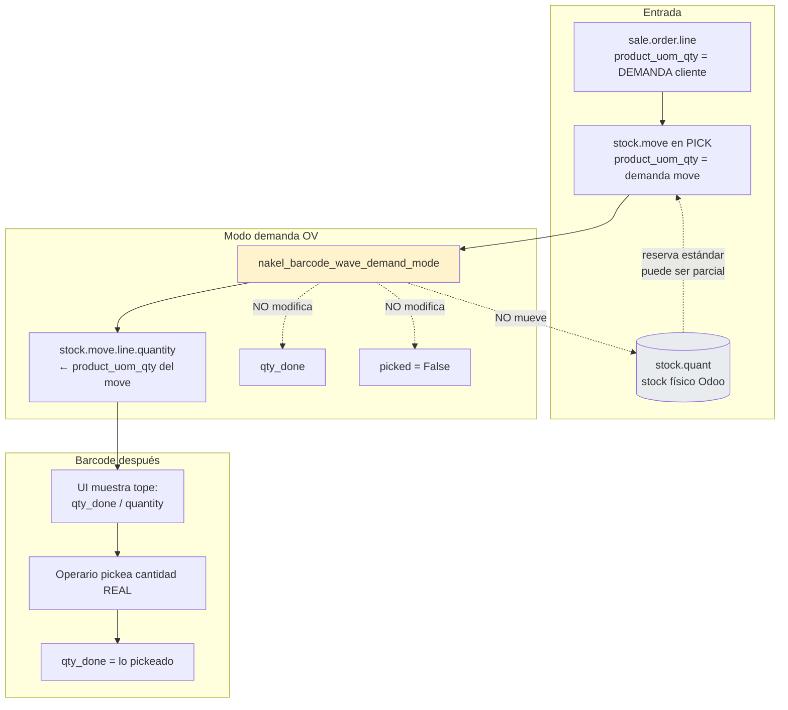
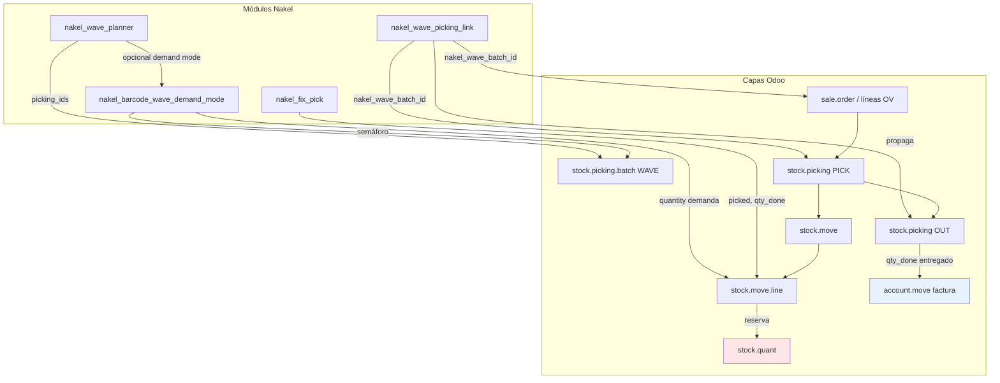
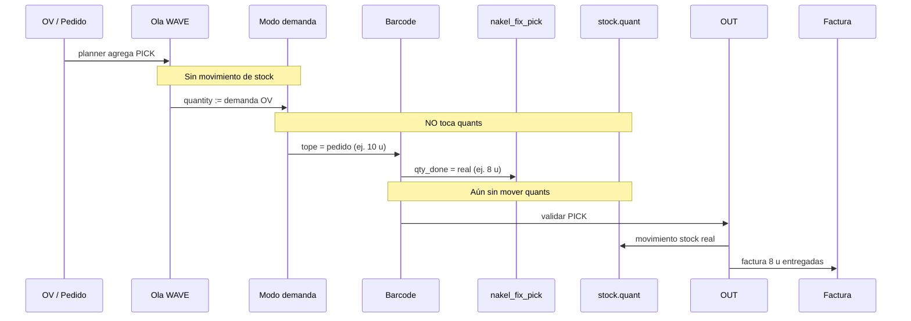

# Olas WAVE + Barcode — Flujo de módulos e impacto en stock

**Fecha:** 2026-05-25  
**Contexto:** Nakel Central (CEN), Odoo 18, olas `WAVE/`, Barcode, inventario desalineado con piso.

Módulos Nakel aplicados en este flujo:

| Módulo | Rol |
|--------|-----|
| `nakel_wave_planner` | Armar ola por zona/vendedor (checklist OV → WAVE) |
| `nakel_wave_picking_link` | Enlace OV ↔ ola (`nakel_wave_batch_id`), salud ola, OUT |
| `nakel_barcode_wave_demand_mode` | Semáforo, Modo demanda OV, Ver faltantes, Agregar a ola |
| `nakel_fix_pick` | Sincronía `picked` / `qty_done` con Barcode |

---

## 1. Flujo operativo completo (supervisor + operario)



---

## 2. Semáforo — decisión antes de Barcode



---

## 3. Modo demanda OV — qué toca y qué NO toca



**Resumen Modo demanda OV:**

| Campo / objeto | ¿Lo modifica? | Efecto |
|----------------|---------------|--------|
| `stock.move.product_uom_qty` | No | Sigue siendo demanda OV |
| `stock.move.line.quantity` | **Sí** | Tope Barcode = pedido OV |
| `stock.move.line.qty_done` | No | Lo pone Barcode al escanear |
| `stock.move.line.picked` | No (False) | No marca verde sin escanear |
| `stock.quant` | **No** | No mueve stock real |
| Reserva Odoo | Bypass SQL en v18 | Evita capa por quants insuficientes |

---

## 4. Mapa de módulos vs capas de Odoo



---

## 5. Impacto en STOCK — matriz por etapa

| Etapa | Módulo | ¿Mueve stock real (`stock.quant`)? | ¿Qué registra? |
|-------|--------|-------------------------------------|----------------|
| Armar ola (planner) | `nakel_wave_planner` | **No** | Agrupa PICK en `batch_id` |
| Enlace OV/ola | `nakel_wave_picking_link` | **No** | Campo `nakel_wave_batch_id` |
| Semáforo / Ver faltantes | `demand_mode` | **No** | Solo lectura + alertas |
| Agregar a la ola | `demand_mode` | **No** | Crea/agrega PICK (`_action_launch_stock_rule`) |
| Modo demanda OV | `demand_mode` | **No** | Sube `move.line.quantity` (tope UI) |
| Barcode pickeo | Odoo + `nakel_fix_pick` | **No** (aún) | `qty_done`, `picked` |
| Validar PICK | Odoo estándar | **Sí** ↓ origen | Sale de Existencias (según config) |
| Validar OUT | Odoo estándar | **Sí** → cliente | Entrega real |
| Facturar | Odoo ventas | **No** (contabilidad) | Importe = lo entregado |



---

## 6. Cadena de cantidades (dónde puede “trabar” Barcode)

```text
OV pide 10 u
    │
    ▼
stock.move.product_uom_qty = 10        ← demanda OV (verdad comercial)
    │
    ▼
stock.move.line.quantity = ?           ← tope Barcode
    │   ├── Sin modo demanda + reserva parcial → 1  ❌
    │   └── Con modo demanda o reserva OK → 10      ✅
    ▼
stock.move.line.qty_done = ?           ← lo que pickeó el operario (0–10)
    │   └── nakel_fix_pick alinea picked / qty_done
    ▼
Validar PICK → OUT → Factura = qty_done entregado
```

---

## 7. Parámetros del sistema (activación)

| Clave | Valor Nakel CEN | Efecto |
|-------|-----------------|--------|
| `nakel_barcode_wave_demand_mode.enable` | `1` | Semáforo + botones |
| `nakel_barcode_wave_demand_mode.apply_on` | `pick` | Solo CEN/PICK |
| `nakel_barcode_wave_demand_mode.warehouses` | vacío o `14` | Alcance almacén |
| `nakel_barcode_wave_demand_mode.include_so_sibling_picks` | `1` | PICK hermanos OV |
| `nakel_fix_pick.enable` | `1` | Sync picked/qty_done |

---

## 8. Regla operativa (una línea)

```text
Planner arma ola → Semáforo verde → Barcode confirma REALIDAD → OUT mueve stock → Factura lo entregado
```

Modo demanda OV solo alinea **Odoo con el pedido** antes de Barcode; **no sustituye** el pickeo ni mueve stock hasta validar.

---

## Referencias

- [BARCODE_OLA_MODO_DEMANDA_PLAN.md](BARCODE_OLA_MODO_DEMANDA_PLAN.md)
- [nakel_barcode_wave_demand_mode/README.md](../../addons/nakel_barcode_wave_demand_mode/README.md)
- [nakel_wave_planner/README.md](../../addons/nakel_wave_planner/README.md)
