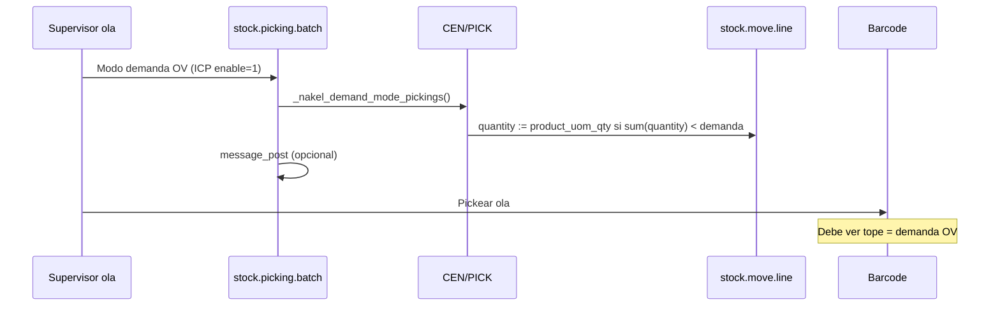

# Barcode + Olas — Modo demanda OV (planning)

**Fecha:** 2026-05-20  
**Contexto:** Nakel Central, olas (`stock.picking.batch`), picking con **Barcode** (`stock_barcode` / `stock_barcode_picking_batch`).  
**Problema:** inventario Odoo desalineado → reserva parcial → Barcode pickea **lo reservado** (ej. 1 u) y no **lo pedido en la OV** (ej. 10 u), aunque en piso haya stock.

---

## 1. Problema de negocio (ejemplo)

| Concepto | Valor |
|----------|------:|
| OV pide | **10** alfajores |
| `stock.move.product_uom_qty` (demanda) | **10** |
| Reserva Odoo (`stock.move.line.quantity`) | **1** (solo hay 1 u “disponible” en Existencias según quants) |
| Operario en Barcode | escanea / ve tope **1** |
| Piso real | puede haber 10 (inventario mal cargado, stock en Entrada, negativos, etc.) |

**Expectativa operativa (temporal):** mientras el inventario no esté confiable, el recolector debe trabajar contra **demanda de la OV**, no contra la reserva que calculó Odoo.

**Requisito clave:** poder **activar y desactivar** el comportamiento (cuando el inventario esté ordenado, volver al flujo estándar Odoo).

---

## 2. Cómo funciona Odoo (cadena estándar)

```text
OV confirmada
  → stock.move (demanda = product_uom_qty = 10)
  → _action_assign (reserva desde ubicación origen del PICK, ej. CEN/Existencias)
       → si quants alcanzan: state=assigned, move.line.quantity=10
       → si no alcanzan: state=partially_available, move.line.quantity=1
  → Barcode (stock_barcode)
       → UI y límites de escaneo usan quantity / reserva en move.line
       → qty_done = lo pickeado
  → Validar picking
       → mueve stock según qty_done (Odoo puede permitir negativo según config)
```

Documentación interna relacionada:

- [wave145/README.md](incidencias/logistica/wave145/README.md) — `partially_available`, demanda vs reservado.
- [DIAGNOSTICO_OLA_FALTANTES_POR_STOCK_EN_ENTRADA.md](DIAGNOSTICO_OLA_FALTANTES_POR_STOCK_EN_ENTRADA.md) — stock en **Entrada** vs **Existencias**.
- [OV_SIN_FACTURAR_SIN_OUT_TRAS_OLA.md](OV_SIN_FACTURAR_SIN_OUT_TRAS_OLA.md) — cadena PICK → OUT tras Barcode.

**Conclusión:** el límite “1 de 10” **no es un bug de Barcode Nakel**; es coherente con **reserva parcial**. Hay que decidir si intervenimos en **reserva/cantidad a pickear** o en **payload/UI de Barcode** (o ambos).

---

## 3. Módulos Nakel existentes (mapa)

| Módulo | Qué hace | ¿Resuelve demanda vs reserva? |
|--------|----------|-------------------------------|
| **nakel_wave_picking_link** | `nakel_wave_batch_id`, salud de ola, OUT ligados, métricas `quantity`/`qty_done`/`picked` | No — trazabilidad y UI |
| **nakel_fix_pick** | Alinea `picked` / `qty_done` con `quantity` (ICP `nakel_fix_pick.enable`); bloquea unlink en olas abiertas | No — asume que **`quantity` ya es la verdad** |
| **nakel_stock_sync_qty_done** | Botón SYNC: `quantity → qty_done` en pickings | No — copia reserva, no sube a demanda |
| **nakel_sync_ola** | SYNC masivo en ola (PICK, no OUT) | No — mismo límite |
| **nakel_barcode_wave_validate_confirm** | Diálogo antes de validar ola/picking | No |
| **nakel_barcode_save_guard** | Mitiga crash si línea borrada en save_barcode | No |
| **nakel_picking** | PDF consolidado ola (usa demanda en fallback PDF) | Solo reporte |
| **nakel_report_picking** | PDF PICK por albarán | Solo reporte |

**Patrón ICP ya usado:** `nakel_fix_pick.enable`, `nakel_barcode_wave_validate_confirm.enable` → conviene **mismo estilo** para el modo demanda.

**Carpetas duplicadas:** `addons/` vs `nakel_odoo/addons/` — desarrollo canónico en **`nakel_odoo/addons/`**.

---

## 4. Brecha (qué falta)

1. **Subir `stock.move.line.quantity` a la demanda** (`move.product_uom_qty` / línea OV) en pickings de ola, **sin** esperar quants correctos.
2. **Barcode** debe mostrar y permitir pickear hasta **demanda**, no hasta reserva parcial.
3. **Toggle global** (y opcional por almacén / tipo PICK) para volver a Odoo estándar.
4. **No romper** módulos actuales (`nakel_fix_pick` sigue siendo útil para `picked`/`qty_done` **después** de que `quantity` refleje demanda).

---

## 5. Opciones de diseño

### A) Solo backend — “forzar quantity = demanda” al asignar ola

**Hook:** heredar `stock.picking.batch` (al confirmar ola / botón dedicado) y/o `stock.picking._action_assign`.

**Acción (si ICP activo y picking es PICK en ola):**

- Por cada `stock.move` con reserva parcial: escribir en líneas `quantity = product_uom_qty` (demanda).
- Opcional: marcar move `state = assigned` (cosmético para Barcode).

**Pros:** simple, Barcode estándar puede funcionar sin JS.  
**Contras:** desincronía reserva real vs quantity; validación puede chocar si hay reglas estrictas.

### B) Override payload Barcode (Python + JS)

**Hook:** heredar controladores `stock_barcode` / `stock_barcode_picking_batch` (`get_barcode_data`, `save_barcode_data`) y assets JS del cliente Barcode.

**Acción:** en respuesta JSON, enviar `quantity` / tope de escaneo = **demanda**; permitir `qty_done` hasta demanda aunque reserva sea menor.

**Pros:** no toca reserva en BD (menos invasivo en assign).  
**Contras:** más frágil ante upgrades Odoo Enterprise; hay que mantener JS.

### C) Híbrido (recomendado)

1. **Backend (A)** al **abrir/preparar ola** o al **entrar a Barcode** en modo demanda: sincronizar `quantity` ← demanda en líneas del batch.
2. **Barcode (B)** solo si hace falta: cap de escaneo en cliente = demanda.
3. **Botón ola “Modo demanda (inventario desfasado)”** visible solo con ICP activo — operación consciente, auditable.

### D) No hacer módulo — solo operación + inventario

- Corregir quants / traslado Entrada → Existencias / ajustes.
- Re-asignar pickings (`action_assign`).

**Pros:** solución “correcta” a largo plazo.  
**Contras:** no escala con el volumen actual de desvío; no resuelve el dolor de hoy.

**Recomendación:** **D a largo plazo + C como puente con toggle**.

---

## 6. ¿Módulo nuevo o extender uno existente?

| Criterio | Extender `nakel_fix_pick` | **Módulo nuevo** (recomendado) |
|----------|---------------------------|--------------------------------|
| Responsabilidad | fix picked/qty_done/unlink | **política demanda vs reserva** |
| Dependencias | ya en producción | `stock_barcode_picking_batch`, `nakel_wave_picking_link` |
| Riesgo al desactivar | mezclado con fix barcode | ICP propio, desinstalar/desactivar limpio |
| Testing | confunde causas | casos de prueba separados |

**Nombre propuesto:** `nakel_barcode_wave_demand_mode` (o `nakel_wave_barcode_demand`).

**No tocar:** `nakel_picking` (PDF), `nakel_report_picking` (reportes).

---

## 7. Parámetros de sistema (propuesta)

| Clave | Default | Significado |
|-------|---------|-------------|
| `nakel_barcode_wave_demand_mode.enable` | `0` | Master switch |
| `nakel_barcode_wave_demand_mode.apply_on` | `pick` | Tipos: `pick` (CEN/PICK), opcional `out` más adelante |
| `nakel_barcode_wave_demand_mode.warehouses` | vacío = todos | IDs almacén CSV, ej. `14` = Central |
| `nakel_barcode_wave_demand_mode.on_assign` | `1` | Reescribir quantity al assign / preparar ola |
| `nakel_barcode_wave_demand_mode.log` | `1` | Log en chatter ola al aplicar modo demanda |

**UI:** Ajustes → Inventario (o botón en formulario ola) + documentación en README del módulo.

---

## 8. Riesgos y mitigaciones

| Riesgo | Mitigación |
|--------|------------|
| Pickear más de lo físicamente existente | Modo explícito “inventario no confiable”; desactivar cuando cuadren quants |
| Negativos más agresivos en Existencias | Ya ocurre hoy; monitorear con informes CEN |
| OUT / facturación desalineada | Modo solo en **PICK**; no forzar OUT (alineado con `nakel_sync_ola`) |
| Conflicto con `partially_available` | Documentar que es **intencional** en modo demanda |
| Upgrade Odoo 18 → 19 | Módulo chico, tests en master_dev; JS mínimo si híbrido |

---

## 9. Plan por fases

### Fase 0 — Validación (1–2 días, sin código)

- [ ] Elegir **3 pickings** reales: demanda 10, reserva 1, piso OK.
- [ ] Confirmar en BD: `product_uom_qty`, `quantity`, `qty_done`, estado move.
- [ ] Reproducir en Barcode master_dev y guardar hora + IP (ver [Diagnostico.md](Diagnostico.md)).

### Fase 1 — MVP backend (módulo nuevo)

**Estado:** bosquejo implementado en `nakel_odoo/addons/nakel_barcode_wave_demand_mode/` (sin instalar en prod aún).

- [x] ICP `enable=0` por defecto.
- [x] Método `stock.picking.batch.action_nakel_apply_demand_mode()`.
- [x] Botón en formulario ola (visible si enable=1).
- [ ] Instalar en master_dev + prueba alfajor 10/1.

Ver **§13 Bosquejo Fase 1** abajo.

---

## 13. Bosquejo Fase 1 (detalle técnico)

### 13.1 Estructura del módulo

```text
nakel_odoo/addons/nakel_barcode_wave_demand_mode/
├── __manifest__.py          # depends: stock_picking_batch, nakel_wave_picking_link
├── README.md
├── data/ir_config_parameter.xml
├── models/
│   ├── ir_config_parameter.py   # ICP + helpers is_enabled / warehouses
│   ├── stock_picking.py         # _nakel_apply_demand_mode() por albarán
│   └── stock_picking_batch.py   # botón ola + chatter
└── views/stock_picking_batch_views.xml
```

**Fuera de alcance Fase 1:** JS Barcode, override `_action_assign`, auto al confirmar ola, OUT/PACK.

### 13.2 Flujo operativo



### 13.3 Algoritmo por `stock.move`

| Paso | Condición | Acción |
|------|-----------|--------|
| 1 | `move.state` in done/cancel o demanda 0 | skip |
| 2 | Sin `move_line_ids` | `create` línea vía `move._prepare_move_line_vals` + `quantity = product_uom_qty` |
| 3 | `sum(line.quantity) >= product_uom_qty` | skip (ya alcanza) |
| 4 | Una sola línea | `line.quantity = product_uom_qty` |
| 5 | Varias líneas (lotes) | sumar faltante `(demanda - reservado)` en la línea con mayor `quantity` |

**No escribe:** `qty_done`, `picked`, `state` del move (dejar explícito para no enmascarar bugs).

### 13.4 Filtro de pickings

Misma búsqueda que `nakel_sync_ola` (`batch_id` **o** `nakel_wave_batch_id`, no done/cancel), pero:

- Excluye OUT (`_nakel_is_out_picking`).
- Con `apply_on=pick` (default): solo `sequence_code == PICK` o nombre `CEN/PICK/…`.
- Si `warehouses` ICP tiene IDs → filtra por `picking_type_id.warehouse_id`.

### 13.5 ICP

| Clave | Default |
|-------|---------|
| `nakel_barcode_wave_demand_mode.enable` | `0` |
| `nakel_barcode_wave_demand_mode.apply_on` | `pick` |
| `nakel_barcode_wave_demand_mode.warehouses` | `` |
| `nakel_barcode_wave_demand_mode.log` | `1` |

### 13.6 UI

- Botón **Modo demanda OV** (`btn-warning`), antes de Validar ola.
- `invisible` si ICP `enable != 1` (campo computed `nakel_demand_mode_enabled`).
- `confirm` con texto de advertencia inventario.

### 13.7 Orden con otros módulos Nakel

```text
1. Confirmar ola / assign estándar (puede quedar partially_available)
2. Modo demanda OV          ← este módulo (sube quantity)
3. Barcode pickear
4. nakel_fix_pick (ICP)     ← picked / qty_done al guardar
5. SYNC Ola+OUT (opcional)  ← quantity → qty_done masivo
6. Validar ola
```

### 13.8 Casos borde (Fase 1 — conocidos)

| Caso | Comportamiento MVP | Fase 2? |
|------|-------------------|---------|
| Move `cancel` por stock en Entrada | No se toca | Corregir stock + nuevo move |
| Varios lotes en un move | Faltante en línea mayor | Reparto proporcional |
| Barcode sigue capando en front | Backend OK pero UI no | Override `get_barcode_data` / JS |
| `state` sigue `partially_available` | Puede ser cosmético | Forzar `assigned` (riesgoso) |
| Ya hay `qty_done=1`, demanda 10 | `quantity` pasa a 10 | OK para seguir pickeando |

### 13.9 Checklist prueba master_dev

1. Buscar PICK con `product_uom_qty=10`, `quantity=1`, ola abierta.
2. `nakel_barcode_wave_demand_mode.enable = 1`.
3. Instalar/actualizar módulo.
4. Ola → **Modo demanda OV** → notificación “Líneas actualizadas: N”.
5. SQL/XML-RPC: `move_line.quantity == 10`.
6. Barcode ola: verificar tope escaneo / demanda mostrada.
7. Pickear 10 → validar → revisar move y quant (negativo esperable si inventario mal).
8. `enable = 0` → botón desaparece; nuevo assign sin botón vuelve a reserva 1.

### Fase 2 — Integración Barcode (si Fase 1 no alcanza)

- [ ] Hook `get_barcode_data` batch: max scan = demanda.
- [ ] Asset JS mínimo (solo si cliente capa en front).

### Fase 3 — Operación e inventario

- [ ] Runbook: cuándo **activar** / **desactivar** modo demanda.
- [ ] KPI: % líneas `partially_available` en olas (script existente wave145).
- [ ] Cuando negativos CEN &lt; umbral → apagar modo y re-`action_assign` masivo.

### Fase 4 — Opcional

- [ ] Auto-aplicar al **confirmar ola** si ICP + flag “auto”.
- [ ] Informe “pickeado vs demanda vs reserva” por ola (CSV en `tools/inventario/`).

---

## 10. Criterios de éxito

1. OV con demanda **10** y reserva **1**: operario Barcode puede completar **10** (o el flujo guía a 10) **con modo activo**.
2. Con modo **desactivado**, comportamiento **idéntico** a Odoo estándar (regresión cero).
3. No aparece hoja/ola validada con **solo** 1 u movida cuando la OV pedía 10 **por culpa del tope de reserva** (caso alfajor).
4. Documentación operativa clara para logística y IT.

---

## 11. Decisión recomendada (resumen)

| Pregunta | Respuesta |
|----------|-----------|
| ¿Hace falta módulo nuevo? | **Sí**, separado de `nakel_fix_pick` |
| ¿Qué hace primero? | **Backend:** `quantity = demanda` en PICKs de la ola (toggle) |
| ¿Barcode JS? | Solo si el MVP backend no basta en pistola |
| ¿Solución definitiva? | **Alinear inventario** (quants, Entrada→Existencias); modo demanda es **puente** |

---

## 12. Referencias en repo

- `nakel_odoo/addons/nakel_wave_picking_link/`
- `nakel_odoo/addons/nakel_fix_pick/`
- `nakel_odoo/addons/nakel_sync_ola/`
- `nakel_odoo/tools/inventario/backup_wave_progress_master_dev.py`
- `nakel_odoo/tools/inventario/sync_qty_done_nakel_wave_batch_xmlrpc.py`
